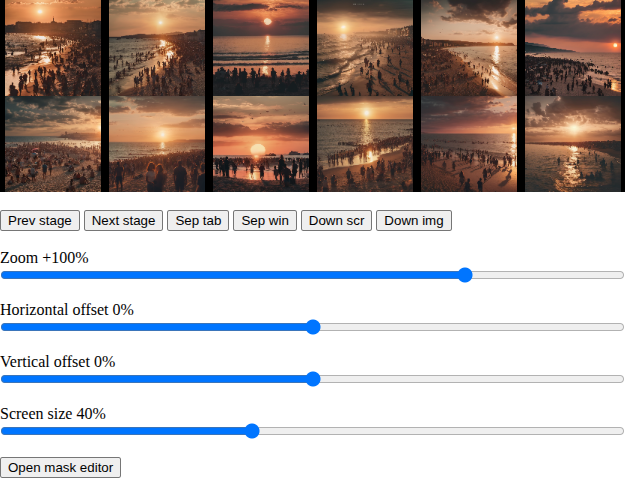
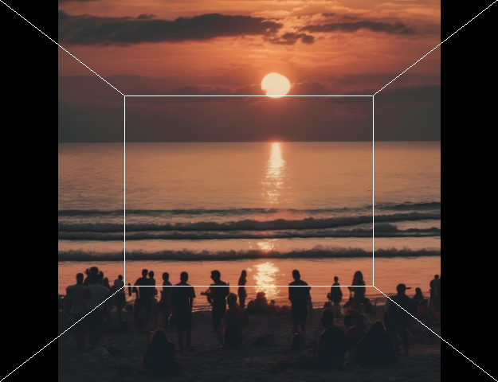
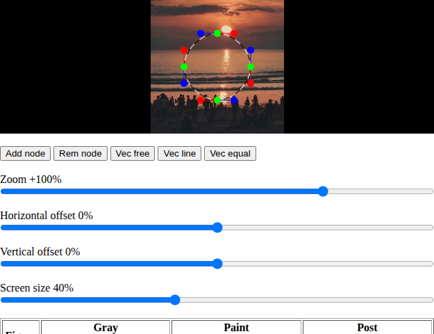
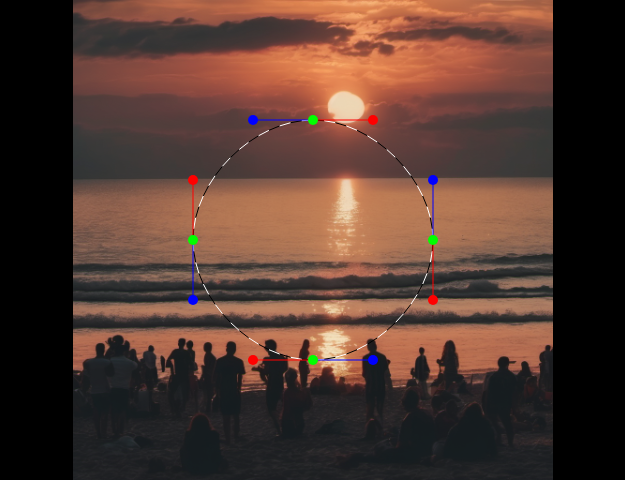
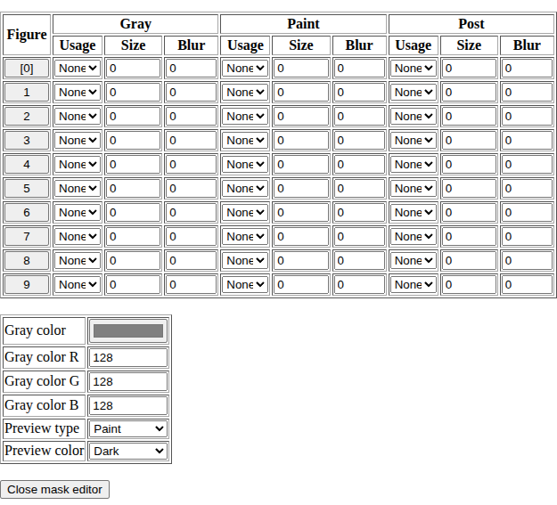
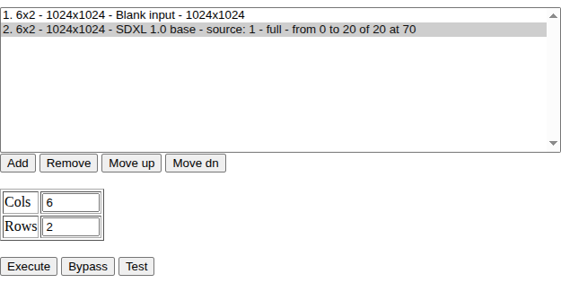
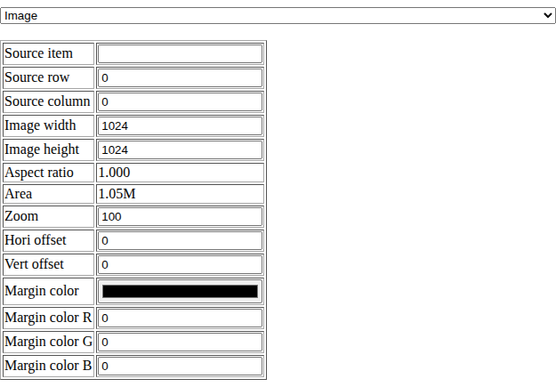
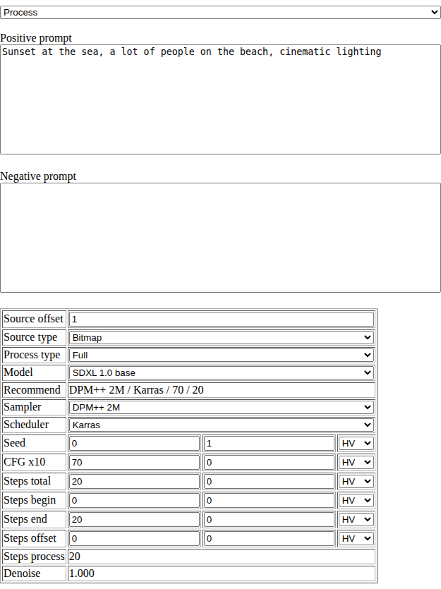
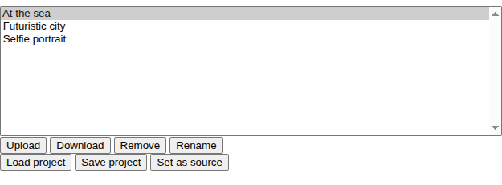

# AILatent overview

**AILatent** is designed for ease image creating using the artificial intelligence, especially with the following models:


* **Stable Diffusion 1\.5** and derivatives
* **SDXL 1\.0 base\+refine** and derivatives

The program uses the **ComfyUI** or **Automatic1111** for create and process images and acts as HTTP client with own interface\. Other models are not tested, but you can use every model, which works with the same **ComfyUI** workflow\.

# Working principle

AILatent project pipeline consists of at least two stages:


* The first stage: **Image** \- New blank image or image from file\.
* The second stage: **Process** \- Greating on transforming image by the artificial intelligence model\.

Every stage has the input and output and pipeline is created by stage chain\.

The input is not used by the Image stage in the following cases:


* New image\.
* Image from file\.

The single process stage consists of the elements:


* Get the image from input\.
* Convert image to latent or get the latent from input\.
* Process latent with multi step generation\.
* Put the processed latent to the output\.
* Convert the latent into image and put the image into the output\.

One pipeline can consist of several **Process** stages\. There are two fundamental process kinds, which are actually the same process with different circumstances:


* **Text to image** \- Generate image from scratch using the text prompt\. For such process, you should use the blank image and process all the steps\. For instance, for process by 20 steps, you should process from the step 0 to step 20\.
* **Image to image** \- Transform image into the another image using the text prompt\. For such process, you should use the existing image \(generated or image from file\) and skip several first steps\. For instance, for process by 20 steps, you can configure 30 steps and process from step 10 to step 30\. For another instance, you can configure 45 steps, from step 25 to step 45\. If the begin step is higher related to total step, the image will be more similar to the input image, but the transfomation will be lesser\.
* **Inpainting** \- Works similarly as **Image to image**, but the working area is defined by mask\.
* **Outpainting** \- Technically is the same as **Inpainting**, the only differencje is the mask shape, which covers the image borders\. In the document, the Inpainting means both **Inpainting** or **Outpainting**\.

If you use two compatible models \(both models uses the same VAE or you use the same model two times\), you can redirect the latent directly instead of bitmap\. The image quality will be a bit higher\.

# Prerequisities

**AILatent** requires the **ComfyUI** or **Automatic1111** and some HTTP local server to run\. Secondary, you have to edit the **config\.txt** configuration file\.

## ComfyUI

At the first, you should install and configure the **ComfyUI v0\.3\.40** or newer version as HTTP server\. You have to manually download and install the image creating models\. These models should be visible as checkpoints or VAE models\.

The default **ComfyUI** address is usually [http://127\.0\.0\.1:8188/](http://http//127.0.0.1:8188/ "http://http//127.0.0.1:8188/"), open the address in the web browser and test every installed model, which you want to use with **AILatent**\.

The **ComfyUI** must be have **CORS** enabled\. Run the **ComfyUI** by following command:

```
python main.py --listen --enable-cors-header
```

## Automatic1111

Alternatively, The **AILatent** can use **Automatic1111 v1\.10\.1** server\. Actually, you can use the **WebUI Forge** or **SD\.Next** server instead of **Automatic1111** due to high API compatibility\. In the document, the **Automatic1111** means any of the three servers\.

The default Automatic1111 address is usually [http://127\.0\.0\.1:7860/](http://127.0.0.1:7860/ "http://127.0.0.1:7860/"), open the address in the web browser and test every installed model, which you want to use with **AILatent**\.

The **Automatic1111** must be have **CORS** enabled\. Run the **Automatic1111** or **WebUI Forge** by following command:

```
./webui.sh --api --cors-allow-origins="*"
```

The **SD\.Next** has the slightly different command to run:

```
./webui.sh --api --cors-origins="*" --backend diffusers
```

## HTTP Server

For run the **AILatent**, there is required to install some HTTP Server, like PHP or Python\. The program works as local webpage, which hould be run as [http://localhost:xxxx](http://localhost:xxxx "http://localhost:xxxx") where xxxx is some port numer, another than the port of **ComfyUI**/**Automatic1111** server\. **AILatent** will not work on HTTPS server\.

## Configuration file

The configuration file is the **config\.txt** file\.

At the first, you shold enumerate the available servers\. You can use several server of the same type\. The parameters has the following syntax, the **?** is the server identifier:


* **Server?Type** \- The server type:
  * **comfyui** \- ComfyUI
  * **a1111** \- Automatic1111, WebUI Forge or SD\.Next
* **Server?Addr** \- The server address with port\.

The global engine parametres are following:


* **EngineDefault** \- The engine selected by default, after AILantent startup\.
* **EngineList** \- The list of engine numbers\.

Each engine is defined as serie of parameters\. In the following description, the **?** character is the engine identifier:


* **Engine?Server** \- The server identifier\.
* **Engine?Name** \- Name of the engine visible in the engine list\.
* **Engine?Type** \- The engine type, one of the following:
  * **0** \- Model requiring the standard latent image\.
  * **1** \- Model requiring the SD3 latent image\.
* **Engine?Model** \- Integrated model file name \(containd bundled diffusion, text encoder and VAE\)\.
* **Engine?ModelText** \- External text encoder file name\. Supported on **ComfyUI** server only\.
* **Engine?ModelDiffusion** \- Diffusion model file name, which produces or transforms picture\. Supported on **ComfyUI** server only\.
* **Engine?ModelVae** \- Latent coder and decoder file name\. Supported on **ComfyUI** server only\.
* **Engine?Steps** \- The recommended step quantity\.
* **Engine?Cfg** \- The recommended CFG value\.
* **Engine?Sampler** \- The recommended sampler algorithm used to denoise, one of the following:
  * DPM\+\+ 2M
  * Euler
  * DPM\+\+ 2M SDE
  * DPM\+\+ SDE
  * Euler A
* **Engine?Scheduler** \- The recommended scheduler algorithm used to denoise, one of the following:
  * Karras
  * Simple
  * Normal
  * Exponential

The engine identifiers represented by the **?** character are used in the **EngineList** parameter\. The parameter represents the engine list abailable in the **AILatent** interface\.

# The AILatent interface

The application acts as a single web page, consisting of the following sections:


* Picture screen
* Stage list
* Stage parameters
* File manager

## Picture screen

The section displays the pictures as matrix layout \(several rows and columns\)\.



The screen displays the pistures as matrix\. If you click the pictute, the picture displays as a single pictuce, to allow the detailed view\. In the zommed picture, the screen has five active areas as descriped below:



The area has the following actions:


* **Left side** \- width equals to 25% of screen height \- Previous picture in the same row, beyond the first picture there will be the last picture from previous row\.
* **Right side** \- width equals to 25% of screen height \- Next picture in the same row, beyond the last picture there will be the first picture from next row\.
* **Top size** \- height equals to 25% of screen height \- Previous picture in the same colum, beyond the first picture there will be the last picture from previous column\.
* **Bottom size** \- height equals to 25% of screen height \- Next picture in the same colum, beyond the last picture there will be the first picture from next column\.
* **Middle box** \- the width equals to 50% of screen width, the height equals to 50% screen height \- Returns to the matrix wiew\.

Below the screen, there are the following buttons with the actions:


* **Prev stage** \- Display the pictures from previous processing stage\.
* **Next stage** \- Display the pictures from next processing stage\.
* **Sep tab** \- Move the screen to separated browser tab, behavior may vary depending on web browser implementation\.
* **Sep win** \- Move the screen to separated browser window, behavior may vary depending on web browser implementation\.
* **Down scr** \- Download the screen as collage\. Resolution depends on picture resolution regardless the actual screen size\.
* **Down img** \- Download the pictures as separated image files\. in the single picture view, there will be downloaded the only picture as file\.

There are the view settings:


* **Zoom** \- The picture zoom percentage according the following rules:
  * **Positive value** \- 100% equals to showing the whole picture \(letter box or pillar box\)\.
  * **Zero** \- stretch without aspect ration maintain\.
  * **Negative value** \- 100% equals to filling screen without margins \(center crop\)\.
* **Horizontal offset** \- Move the picture horizontally, allows to view details in high zoom across the whole picture\.
* **Vertical offset** \- Move the picture vertically, allows to view details in high zoom across the whole picture\.
* **Screen size** \- The screen size as the percentage of web browser window heigh\. Does not matter while the screen is in separated tab or separated window\.

Below, there is the **Open mask editor** button, which opens the mask editor for **Inapinting**\.

## Mask editor

If you click the **Open mask editor** button, you can create the mask consisting of up to 10 spline figures\.



In this state, you can change the shape by dragging the nodes \(green points\) and vectors \(red points and blue points\)\. The row of buttons will be replaced int the following buttons:


* **Add node** \- Add node into the shape\. Click the button, then green points between existing nodes will be shown\. Click the one of the point and the new node will be added\.
* **Rem node** \- Remove node from the shape\. Click the button, then click one of the nodes and the clicked node will be removed\.
* **Vec free** \- Change the nodes to set the free vectors \(vectors will be totally independed\)\. Click the button, then click the note to change the vector mode\.
* **Vec line** \- Change the nodes to set the vectors on the same line \(vectors can have different length, but are in opposite directions\)\. Click the button, then click the note to change the vector mode\.
* **Vec equal** \- Change the nodes to set the equal vectors length \(vectors will have the same length, and the opposite directions\)\. Click the button, then click the note to change the vector mode\.

You can also change the figure shape in the separated window:



In the place of the **Open mask editor** button, you will see the two tables and the **Close mask editor** button\.



The first table represents the 10 spline figures and the current figure can be selected by clicking the button in the **Figure** column\.

Actually, the mask consists of three elements:


* **Gray** \- Replae the masked image into the gray area\.
* **Paint** \- Use the mask for inpainting process
* **Post** \- Postprocessing mask, replace the inpainted image with original image in unmasked area

For the every element, you can set the following parameters:


* **Usage** \- Use the figure as following:
  * **None** \- Do not use the figure\.
  * **Posi** \- Positive usage, the figure will be added, the first figure will be added into blank image\.
  * **Nega** \- Negative usage, the figure will be subtracted, the first figure will be subtracted into full image\.
* **Size** \- Change the figure size without changing the shape:
  * **Negative value** \- Figure will be smaller\.
  * **Positive value** \- Figure will be larger\.
* **Blur** \- Blur or feather the mask\.

The second table allows to set the actual Gray color\. You can set any other color for experimental purposes\.

The following options are for previewing purposes only, does not affect the mask work:


* **Preview type** \- Which mask will be previewed:
  * **None** \- No preview\.
  * **Gray** \- Preview gray mask\.
  * **Paint** \- Preview inpainting mask\.
  * **Post** \- Preview postprocessing mask\.
* **Preview color** \- How the mask will be previewed:
  * **None** \- No preview\.
  * **Dark** \- Mark will be darker\.
  * **Bright** \- Mask will be brighter\.
  * **Dark/Bright** \- Full covering mask will be darker, the blur area will be brighter\.
  * **Bright/dark** \- Full covering mask will be brighter, the blur area will be darker\.

In some circumstances, the preview can be pixelated \(lower resolution\) due to preview performance reasons\. The actually applie mask will be always smooth\.

At the bottom, there is the **Close mask editor** button, which closes the mask editor\.

## Stage list

The section is intended to display the stage list with the some parameters\. In the section, you can add stage, remove stage, execute stage and test the connection with server\.



Every stage in the list displays the following information:


* Stage number on the stage list
* Matrix size of cached images
* Resolution of cached images
* Brief stage information depends on stage type

Below the stage list, there are four buttons:


* **Add** \- Add new stage as copy of selected stage
* **Remove** \- Remove selected stage
* **Move up** \- Swap the selected stage with previous stage
* **Move dn** \- Swap the selected stage with next stage

Below the buttons, there are following fields and buttons:


* **Cols** \- Number of image matrix columns to be generated\.
* **Rows** \- Number of image matrix rows to be generated\.
* **Execute** \- Execute the selected stage\.
* **Bypass** \- Copy the image from input to output without using the server\.
* **Test** \- Test the connection with engine\.

## Stage parameters

The section allows to configure specified stage\. Every stage can be one of tho types:


* **Image**
* **Process**

The type can be changed using the drop down list and each stage type has different parameters\.

## Stage parameters \- Image

The **Image** stage creates or reads the image, which can be processed\. Every batch should be begin from the **Image** stage\.



The parameters are the following meaning:


* **Source item** \- The image source, depends on value type:
  * **Blank** \- Generate new, blank image\.
  * **Number** \- Redirect from output of another stage, the number is the stage offset\. For instance, **1** means the previous stage\.
  * **File name from file manager** \- Gets the stored imge as input image\.
* **Source row** \- The number of row for image redirect, does matter in the image redirect only:
  * **0** \- Redirect every row as are\.
  * **n>0** \- Redirect the row **n** into every row\.
* **Source colum** \- The number of column for image redirect, does matter in the image redirect only:
  * **0** \- Redirect every colum as is\.
  * **n>0** \- Redirect the column **n** into every column\.
* **Image width** \- The image width at the stage output, image in another size will be scaled\.
* **Image height** \- The image height at the stage output, image in another size will be scaled\.
* **Aspect ratio** \- The image width divided by image height\.
* **Area** \- The image width multiplied by image height\.
* **Zoom** \- Input image zoom \(redirect or existing file only\), value can be following:
  * **Positive value** \- 100% equals to showing the whole picture \(letter box or pillar box\)\.
  * **Zero** \- stretch without aspect ration maintain\.
  * **Negative value** \- 100% equals to filling screen without margins \(center crop\)\.
* **Hori offset** \- Input image horizontal offset\.
* **Vert offset** \- Input image vertical offset\.
* **Margin color** \- The color of margin area, when the image is blank or the source image does not cover the whole canvas\.

For instance, the image matrix consists of three rows and four columns, the input image are following:

```
A B C D
E F G H
I J K L
```

Using the **Source row** as **0** and **Source column** as **0**, you will have the same layout:

```
A B C D
E F G H
I J K L
```

Using the **Source row** as **2** and **Source column** as **0**, you will have the row 2 redirected into every row:

```
E F G H
E F G H
E F G H
```

Using the **Source row** as **0** and **Source column** as **4**, you will have the column 4 rediredted into every column:

```
D D D D
H H H H
L L L L
```

Using the **Source row** as **1** and **Source column** as **3**, you will have the single image rediredted into every image:

```
C C C C
C C C C
C C C C
```

## Stage parameters \- Process

The Process stage is the fundamendal stage, which generates or transforms the image\.



The most important fields are the **prompts**:


* **Positive prompt** \- The description or features, which should be included in the image\.
* **Negative prompt** \- The features, which should be excluded, the field can be leaved blank\.

The stage parameters are the following:


* **Source offset** \- The stage offset to use the output, value is relative to the current stage\. Value **1** means the previous stage\.
* **Source type** \- The data type, which will be transfered from the another stage output \(**ComfyUI** only\):
  * **Bitmap** \- Use bitmap, recommended in most cases
  * **Latent** \- Use only when the previous stage is Process and uses the same model or compatible model \(the same VAE between bitmap and latent conversion\)\.
* **Process type** \- The process type, one of the following \(supported on **ComfyUI** server\):
  * **Full** \- Single\-stage process, this stage is both **begin** and **end**\.
  * **Begin** \- The first stage of multi\-stage generation\.
  * **Middle** \- Any stage of multi\-stage generation, which is neither **begin** nor **end**\.
  * **End** \- The last stage of multi\-stage generation\.
* **Model** \- Select the model to be used within the process\.
* **Recommended** \- The recommended sampler, scheduler, CFG and number of steps for the selected model\.
* **Sampler** \- The denoise sampling algorithm used for the process\. The affect the image quality:
  * **Euler**, **DPM\+\+ 2M** \- The samplers recommended in the most cases\.
  * **LCM** \- Sampler required for some specific "lightning" or "turbo" models, which usually generates within about 5 steps\.
* **Scheduler** \- The step scheduling algorithm used for the process:
  * **Karras**, **Normal** \- Recommended in most cases\.
  * **Simple**, **SGM uniform**, **Exponential** \- Other schedulers, may be required with some models\.

The **SD\.Next** server has different scheduler algorithms and the shedulers have different meaning:


* **Karras** \- Karras\.
* **Simple** \- Default\.
* **Normal** \- Flowmatch\.
* **Exponential** \- Exponential\.
* **SGM Uniform** \- Lambdas\.
* **DDIM Uniform** \- Betas\.

The following parameters are the numeric values\. Every value consists of the three elements:


* **Base value** \- The value used in the first image\.
* **Increment value** \- The value difference between images in the matrix\.
* **Incrementation direction** \- Determines how the value will be incremeneted across the image matrix\.
* **HV** \- Increment horizontally by increment value, then increment vertically by the increment value multiplied by number of columns\.
* **VH** \- Increment vertically by increment value, then increment horizontally by the increment value multiplied by number of rows\.
* **H** \- Increment horizontally only, every row has the same value\.
* **V** \- Increment vertically only, every row has the same value\.

For instance, the image matrix consists of three rows and four columns, the base value is **10** and increment value is **2**\. The Incrementation direction works as following:

Horizontal vertical:

```
[10][12][14][16]
[18][20][22][24]
[26][28][30][32]
```

Vertical horizontal:

```
[10][16][22][28]
[12][18][24][30]
[14][20][26][32]
```

Horizontal:

```
[10][12][14][16]
[10][12][14][16]
[10][12][14][16]
```

Vertical:

```
[10][10][10][10]
[12][12][12][12]
[14][14][14][14]
```

The numeric values are following:


* **Seed** \- The seed number used for random noise\.
* **CFG x10** \- The Classifier Free Guidance multiplied by 10\. For instance, value 75 meand the real value as 7\.5\.
* **Steps total** \- The total number of steps, which are scheduled in the process stage\.
* **Steps begin** \- The first step, which will be performed within the proecss stage\. The minimum value is **0**\.
* **Steps end** \- The last step, which will be performed within the proecss stage\. The maximum value equals to **Steps total**\. The parameters works in **ComfyUI** server only\.
* **Steps offset** \- Add or subtracts the value to **Steps total**, **Steps begin**, **Steps end** for change the **denoise** value by just changing single value, without changing the actual number of step\.

The last fields are for information only, determined from the base values:


* **Steps process** \- The actual number of steps which will be performed\.
* **Denoise** \- The denoise factor, which is implicated from the **Steps total** and **Steps begin**\. The value 1\.000 means full image process, the value below 1\.000 means the partial image transform\.

## File manager

The last section is the simple file manager\. The storage capacity is determined by web browser **IndexedDB** implementation, the file manager is intended to store images, whis is used as source images \(not images prevously generated\) and generation projects \(the stage list\)\. The main field is the file list\.



Below the file manager, there are the followin button:


* **Upload** \- Upload file from your device into the **File manager**\.
* **Download** \- Download file from the **File manager** into your device\.
* **Remove** \- Remove item from the **File Manager**\.
* **Rename** \- Rename the item in the **File Manager**\.
* **Load project** \- Load project from the **File manager** to **Stage list**\. The currently unsaved project will be clear\.
* **Save project** \- Save the project from the Stage list to File Manager\. If the file exists, the file will be overwritten\.
* **Set as source** \- Copy the selected file name into the **Source item** of the currently selected stage\.

# Usage examples

Here there are the usage examples across the several pipeline types\. Let's assume, that you have instaled the following models in **ComfyUI** or **Automatic1111**:


* **SD 1\.5** \- optimized for 512x512 resolution\.
* **SDXL 1\.0 base** \- optimized for 1024x1024 resolution\.

For every stage example there is provided the most important parameters\. Non\-provided parameters is not important for demonstrate the example features\.

## Inpaint remarks

The **Inpaint** or **Outpaint** process is technically the same as the **Image to image** process\. There are the following differences from the actual **Image to image**:


* Uses the mask\. Click the **Open mask editor**, create the mask shapes, configure the shape sizes and behavior for three masks as necessary \(gray, paint, post\) and click the **Close mask editor**\.
* The denoise can be 1\.00, so the **Step begin** can be 0 for **Inpainting** or **Outpainting**\.
* The **Inpainting** and **Outpaintig** are exactly the same process\. The only difference is in the mask:
  * **Inpainting** \- Mask covers area inside the picture\.
  * **Outpainting** \- Mask covers area outsinde the picture including the picture border\.

The **Inpainting** or **Outpainting** result depends on the model\. Not every model gives the good results, especially **Outpainting** results\. You should try several models if possible\.

## Text to image with several variants \(ComfyUI, Automatic1111\)

The Text to image is the most fundamental process\. Let's create three different images, every image will be ceated with 15 steps, 20 steps and 25 steps for compare the step number difference in result\.

You have to create the two stages:


* **Stage 1** \- **Image** \- The blank image:
  * **Source item** \- leave blank
  * **Image width** \- 1024
  * **Image height** \- 1024
* **Stage 2** \- **Process** \- Creating image from scratch:
  * **Source type** \- Bitmap
  * **Model** \- SDXL 1\.0 base
  * **Seed** \- 0, 1, HV
  * **Steps total** \- 20, 0, HV
  * **Steps begin** \- 0, 0, HV
  * **Steps end** \- 20, 0, HV
  * **Steps offset** \- 0, 0, HV

Execute the pipeline with number of rows as 3 and colums as 4, you will get the 12 different images at once\. Every row will present the different number of steps, every column will present different scenery variant\.

## Image to image with denoise test \(ComfyUI, Automatic1111\)

The example transforms one image into the another image for several denoise variants\. Assuming generating the images as three rows and four columns, we will test four denoise variants\.

You have to upload the image file for the first stage\. Assuming, that original image has 2048x1536 resolution, the aspect ratio is 4:3\. The SDXL models is optimized for 1024x1024, but also works with other resolutions, but the image area should be near 1M pixels like 1024x1024 image\. The optimal resolution is the 1152x864 in case of 4:3 image, but you can try the higher or lower resolution\.

Assume, that the image is stored as **TestImage\.jpg** in File manager, so the stages will be following without **Step offset**:


* **Stage** 1 \- **Image** \- The image from file with scaling:
  * **Source item** \- TestImage\.jpg
  * **Image width** \- 1152
  * **Image height** \- 864
* **Stage 2** \- **Process** \- Transform the image into another image using the text prompt:
  * **Source type** \- Bitmap
  * **Model** \- SDXL 1\.0 base
  * **Seed** \- 0, 1, H
  * **Steps total** \- 30, 5, V
  * **Steps begin** \- 10, 5, V
  * **Steps end** \- 30, 5, V
  * **Steps offset** \- 0, 0, V

The same scenariu with **Step offset**:


* **Stage** 1 \- **Image** \- The image from file with scaling:
  * **Source item** \- TestImage\.jpg
  * **Image width** \- 1152
  * **Image height** \- 864
* **Stage 2** \- **Process** \- Transform the image into another image using the text prompt:
  * **Source type** \- Bitmap
  * **Model** \- SDXL 1\.0 base
  * **Seed** \- 0, 1, H
  * **Steps total** \- 20, 0, V
  * **Steps begin** \- 0, 0, V
  * **Steps end** \- 20, 0, V
  * **Steps offset** \- 10, 5, V

If the matrix has three rows and four columns, you will get the four images with three different denoises across the rows, every image will be generated by 20 steps:


* **First row** \- The step begin is 10, total scheduled steps are 30, so the denoise is **0\.667**
* **Second row** \- The step begin is 15, total scheduled steps are 35, so the denoise is **0\.572**
* **Third row** \- The step begin is 20, total scheduled steps are 40, so the denoise is **0\.500**

## Several image to image stages \(ComfyUI, Automatic1111\)

You can generate the image from scratch and improve the image by additional stages\. The image will be created by SD 1\.5 and the image will be improved two times by SDXL 1\.0 refiner and the best result will be processed one more times\.

The pipeline consists of 16 images within four columns and four rows\.

Important: If you use the same model severa times, the random seed should be different between the stages\. Otherwise, the image will be distorted\. The good practice is use different seed for every stage\.

For best results, you should transfer the latent between stages uding the same model\.


* **Stage 1** \- **Image** \- Create the blank image for SD 1\.5
  * **Source item** \- leave blank
  * **Image width** \- 512
  * **Image height** \- 512
* **Stage 2** \- **Process** \- Generate the first image
  * **Source type** \- Bitmap
  * **Model** \- SD 1\.5
  * **Seed** \- 0, 1, HV
  * **Steps total** \- 20, 0, HV
  * **Steps begin** \- 20, 0, HV
  * **Steps end** \- 20, 0, HV
  * **Steps offset** \- 0, 0, HV
* **Stage 3** \- **Image** \- Resize the image to 1024x1024
  * **Sourse item** \- 1
  * **Source row** \- 0
  * **Source column** \- 0
  * **Image width** \- 1024
  * **Image height** \- 1024
* **Stage 4** \- **Process** \- First image improvement, the SDXL is not compatible with SD 1\.5, it uses differetn VAE\.
  * **Source type** \- Bitmap
  * **Model** \- SDXL 1\.0 base
  * **Seed** \- 1, 1, HV
  * **Steps total** \- 20, 0, HV
  * **Steps begin** \- 20, 0, HV
  * **Steps end** \- 20, 0, HV
  * **Steps offset** \- 10, 0, HV
* **Stage 5** \- **Process** \- Second image improvement, the SDXL, you can transfer the latent\.
  * **Source type** \- Latent
  * **Model** \- SDXL 1\.0 base
  * **Seed** \- 2, 1, HV
  * **Steps total** \- 20, 0, HV
  * **Steps begin** \- 20, 0, HV
  * **Steps end** \- 20, 0, HV
  * **Steps offset** \- 10, 0, HV
* **Stage 6** \- **Image** \- Select the best result from thw first improvements, assume that the best result is in row 2 and column 3, the latent will be transfered untouched\.
  * **Source item** \- 1
  * **Source row** \- 2
  * **Source colums** \- 3
* **Stage 7** \- **Process** \- Further image improvement, the latent is transfered and can be used\.
  * **Source type** \- Latent
  * **Model** \- SDXL 1\.0 base
  * **Seed** \- 3, 1, HV
  * **Steps total** \- 20, 0, HV
  * **Steps begin** \- 20, 0, HV
  * **Steps end** \- 20, 0, HV
  * **Steps offset** \- 10, 0, HV

## Parial process preview \(ComfyUI\)

Generating the image can take long time, so you can prepare the partial image generation for evalueate the probably result before generate finishes\. Lets's assube, the splitting the generation into three parts:


* First part \- 8 stages of 20
* Second part \- 7 stages of 20
* Third part \- 5 stages of 20

In this case, you have to redirect the latent between the parts\. The other parameters and the prompt should be the same\. The pipeline will consist of 4 stages:


* **Stage 1** \- **Image** \- Create blank image or read the image from file
  * **Width** \- 1024
  * **Height** \- 1024
* **Stage 2** \- **Process** \- The first part
  * **Source type** \- Bitmap
  * **Process type** \- Begin
  * **Model** \- SDXL 1\.0 base
  * **Steps total** \- 20, 0, HV
  * **Steps begin** \- 0, 0, HV
  * **Steps end** \- 8, 0, HV
  * **Steps offset** \- 0, 0, HV
* **Stage 3** \- **Process** \- The second part
  * **Source type** \- Latent
  * **Process type** \- Middle
  * **Model** \- SDXL 1\.0 base
  * **Steps total** \- 20, 0, HV
  * **Steps begin** \- 8, 0, HV
  * **Steps end** \- 15, 0, HV
  * **Steps offset** \- 0, 0, HV
* **Stage 4** \- **Process** \- The third part
  * **Source type** \- Latent
  * **Process type** \- End
  * **Model** \- SDXL 1\.0 base
  * **Steps total** \- 20, 0, HV
  * **Steps begin** \- 15, 0, HV
  * **Steps end** \- 20, 0, HV
  * **Steps offset** \- 0, 0, HV

If you execute the **Stage 1** and **Stage 2**, you will see the result after the first parts\. If the result is enough and you evaluates, that the result is probably good result, or you can not evaluate the result due to high noise, you should run the **Stage 3** only for see more detailed result\.

If you not accept the result from the **Stage 2**, you should change the prompt and other elements \(model, SFG, scheduler, sampler\) in the **Stage 2** and execute the **Stage 2** on more time\. if the stage 2 finishes and you accept the results, set the same parameters for the **Stage 3** and **Stage 4**\. Execute the **Stage 3** and after the result watch, execute the **Stage 4** for final result\.

## Multiple models or multiple prompts \(ComfyUI\)

You can simulate the single generating stage with several parts\. Between the stages, the parameters can be different\. The good example is using the SDXL 1\.0 base with SDXL 1\.0 refineer\. The working principle is the same as in above example, but you will generate across two parts and the model is intentionally different in the second part, assuming that the refiner will be used for last 7 steps:


* **Stage 1** \- **Image** \- Create blank image or read the image from file
  * **Width** \- 1024
  * **Height** \- 1024
* **Stage 2** \- **Process** \- The first part
  * **Source type** \- Bitmap
  * **Process type** \- Begin
  * **Model** \- SDXL 1\.0 base
  * **Steps total** \- 20, 0, HV
  * **Steps begin** \- 0, 0, HV
  * **Steps end** \- 14, 0, HV
  * **Steps offset** \- 0, 0, HV
* **Stage 3** \- **Process** \- The second part
  * **Source type** \- Latent
  * **Process type** \- End
  * **Model** \- SDXL 1\.0 base
  * **Steps total** \- 20, 0, HV
  * **Steps begin** \- 14, 0, HV
  * **Steps end** \- 20, 0, HV
  * **Steps offset** \- 0, 0, HV


